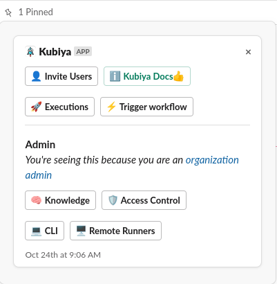
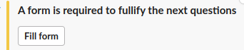
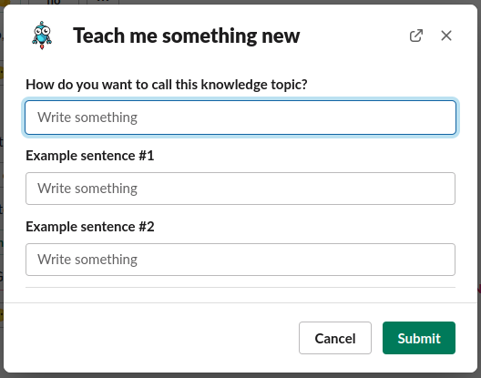
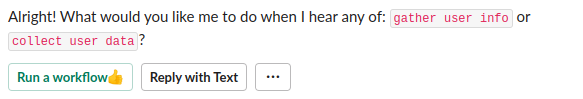
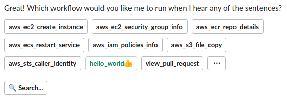

# Teaching Kubiya to be Smarter

## Knowledge Overview

As your users interact with Kubiya, it may become necessary to improve the usability by shortening the path to workflows.  Often we would like to have a "shortcut" to launching a workflow that is used frequently.  This is done by leveraging Kubiya's Knowledge capabilities.  By teaching Kubiya how to respond to natural language commands, we can make our users lives easier.

## Example Usage

To teach Kubiya something new, we can leverage the Pinned message menu in the Slack App.  Click the 'Knowledge' button in the pinned message as below.

This launches an internal workflow that will first ask you if you want to add a new Knowledge entry or delete an existing entry.  Click the 'Add' button.

Adding a new entry requires Slack to launch a form dialog, click the "Fill Form" button.

When completing the form, the first field will be the name of the Knowledge Topic you are creating.  This will be used if you want to delete this entry in the future.

The next two fields are example natural language statements that the system will react to when a user issues them.  In our example we used 'gather user info' and 'collect user data'.

Once you teach Kubiya what natural language statements to respond to, you will be asked what Kubiya should do when they are invoked.  You may choose to launch a workflow or reply to the user with a text message.  Select "Run a Workflow".

Select which workflow you would like to invoke.

That's it!

## Testing Knowledge

To test your newly trained knowledge, simple issue the natural language command that you trained.