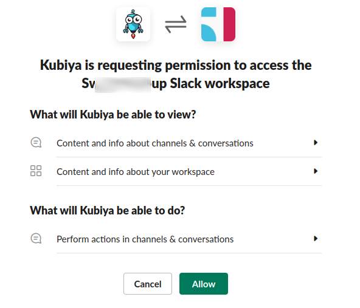
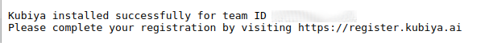

# Enabling Integrations from the CLI

Integrating Kubiya with other applications provides extended functionality allows the workflows to interact with the outside world.  For instance, given a certain event or approval that is required, you may want to open a ticket in Jira.  Kubiya supports Integrations with Slack, Jira, AWS and several identity providers.

## Slack Integration

Slack Integration is available through 

By Clicking on the Add to Slack button above you will be prompted to approve Kubiya's access to your workspace.

If successful, Slack will return the following:

## Jira Integration

## AWS Integration

Kubiya offers an easy-to-use integration with Amazon Web Services. This integration allows you to perform a variety of actions on AWS using Kubiya.

To complete the AWS Integration you will need to create a Role for Kubiya using the Kubiya AWS account number and enable the integration at the Kubiya CLI.

Complete instructions can be found [here](gs_integrations_aws.html).

