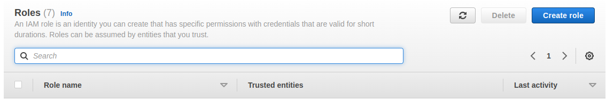
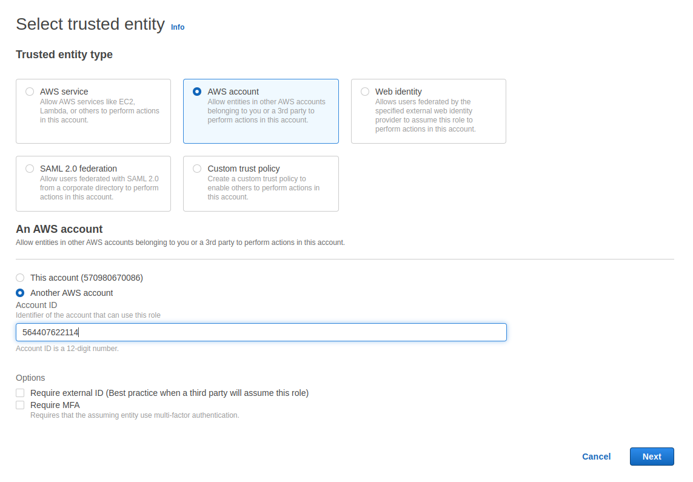
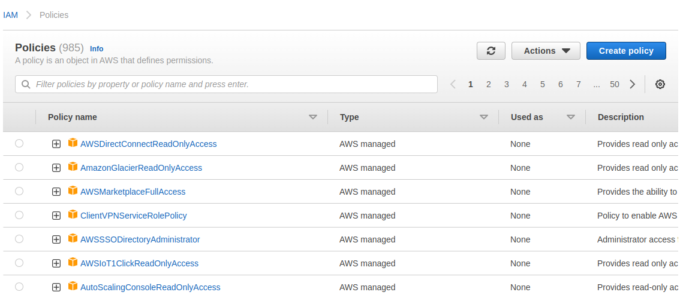
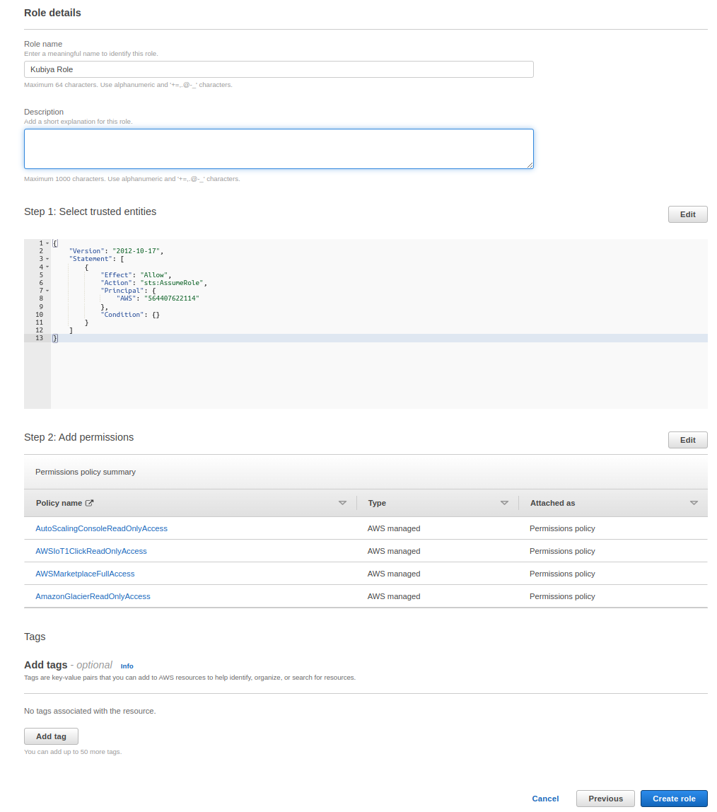

# AWS Integration

Kubiya offers an easy-to-use integration with Amazon Web Services. This integration allows you to perform a variety of actions on AWS using Kubiya.

To complete the AWS Integration you will need to create a Role for Kubiya using the Kubiya AWS account number and enable the integration at the Kubiya CLI.

## STEP 1 - Create a Role in AWS

1. Login to your AWS console and navigate to the Identity and Access Management (IAM) page.
2. Click on the 'Roles' section
3. Click "Create Role" button in the top right corner

    

4. In the "Select trusted entity" dialog:
    1. Select "AWS account"
    2. Select "Another AWS account
    3. Enter the Kubiya Account ID in the identifier input box
            564407622114
    4. Click Next

    

5. In the 'Policies' dialog, select the access rules that you would like Kubiya to have access to, then click Next

    

6. In the "Role details" dialog:
    1. Name the role, you will need this later.
    2. Confirm the Kubiya Account ID in the JSON under "Step 1: Select trusted entities"
    3. Confirm the selected permissions under "Step 2: Add permissions"
    4. If correct, click the "Create role" button

    

## STEP 2 - Enable AWS Integration in the Kubiya CLI

1. At the command prompt issue the following command with:
    1. The AWS region that your Role was created in
    2. Your AWS Account ID
    3. The Role Name that you created in the steps above

    ```bash
        kubiya integration enable -n aws -c '{"aws_region": "<aws_region>", "aws_account_id": "<your_aws_account_id>", "role_name": "<role_name>"}'
    ```

2. If successful the CLI will return the following:

    

3. If unsuccessful the CLI will return an error.  Reconfirm your role configuration.  If everything looks correct and the error persists contect support.