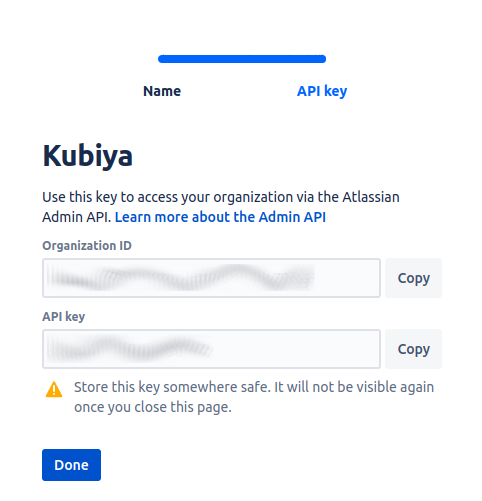

# Jira Integration

Kubiya supports integration with Atlassian JIRA. This integration allows you to view , create and update JIRA issues from Kubiya.

## STEP 1 - Create an API Key in Jira

1. Login to your Atlassian Admin account and navigate to Settings
2. Click on the "API Keys" Section
3. Click "Create API Key" button in the top right corner

    

4. In the "Create an API key" dialog:
    1. Name the API Key
    2. Select the desired expiration date of the key
    3. Click 'Create'

    

5. In the 'API key' dialog, Copy and Store the Organization ID and the API key to a safe location.  You will need these in the next step

    

## STEP 2 - Create a Kubiya Secret from the Kubiya CLI

1. At the command prompt issue the following command with the API Key that was created above:

    ```bash
        kubiya secret create -n jira/api_token -v "<your API Key>"
    ```

2. If successful the CLI will return the following:

    

3. If unsuccessful the CLI will return an error.

## STEP 3 - Enable Jira Integration from the Kubiya CLI