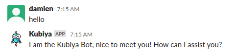

# Let's build your first workflow

## Creating a workflow from scratch

We are going to create a simple workflow that asks the user a yes or no question, makes a decision based on that question and collects some simple identifier information from them.  Let's get started.

1. At the command line create a new file called 'hello_world.yaml'.

    ```bash
        touch hello_world.yaml
    ```

2. Open the 'hello_world.yaml' file in your favorite editor and add the following contents:

```yaml
version: 3
type: conversation
steps:
  - id: name
    prompt: Please enter your name
    type: input
    value_type: text
    validators:
      - text_longer_than: 4
  - id: age
    type: input
    value_type: numeric
    prompt: How old are you
    validators:
      - min: 9
      - max: 99
      - is_integer: true
  - id: validate
    type: input
    prompt: Are these correct? Name - ${name}  Age - ${age}
    value_type: boolean
  - id: test
    type: condition
    if:
      arg: ${validate}
      is: equals
      arg2: "true"
      then: output
      else: exit
  - id: output
    type: message
    prompt: Hello, ${name}.  Welcome to Kubiya!
  - id: exit
    type: exit
```

## Validating a workflow

It is important to validate that the syntax and steps in a workflow.  You will be unable to upload the workflow in Kubiya until it passes validation.  To validate our new workflow, run the following command:

```bash
kubiya workflow validate hello_world.yaml
```

## Uploading a workflow

In order to make the workflow executable, you must upload the workflow to the Kubiya Platform by running the following command:

```bash
kubiya workflow upload -n hello_world hello_world.yaml
```

When the upload is successful you will see the follwing message:


## Executing a workflow

You can execute a workflow from the CLI or from the Kubiya Slack Application.

### Executing from the CLI

When executing a workflow from the CLI you must pass the variable expected from the command line.  Interactive execution is not available at this time.


### Executing from Slack

1. Enter the Kubiya Slack Application and send a 'hello' message

    

2. Send Kubiya the message: "execute a workflow"

    

    Kubiya will respond with the list of available workflows.

3. Click on the 'hello_world' worflow.  If necessary, expand the list to find the appropriate tile to click on.

    

4. Follow the prompts to walk through the workflow.

    

5. Congratulations!  You have completed your first workflow.
